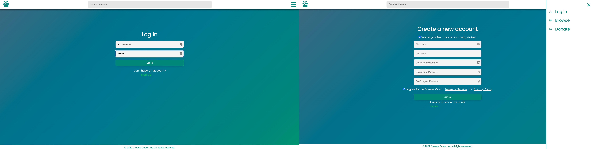

# Project_Greene

## About
Greene Ocean seeks connect people in need with those more fortunate through technology. Our web application provides a platform for prospective donors to create an account (authentication achieved without the use of an external API), post their donations and upload photos of their donations. Donors have the ability to live chat and/or video chat with perspective recipients before approving the transaction, allowing greater control over where their donation is going. Likewise, donation recipients have the ability to browse available donations in their area and claim items based on their individual needs and circumstances. Integration with Google Maps API makes browsing easy. Charities have the option to claim exclusive donations marked as for charity only.

  

This project was created by eight engineers working closely over the course of one week to meet the requests of a client based in Austin, Texas. As a team, we believe that tools like our website will inspire generosity among those in your local community and connect everyone on a deep and fundamental level.

## User Stories
- As a user you should be able to sign-up/login with a secure username and password.

- As a signed in user you should be able to donate items.

- As a signed in user you should be able to browse items in your area.

- As a signed in user you should be able to view your donated items, items you'd expressed interest in, approved items, history of your transactions and chat with other users.

## Technologies

## Contributors
* [Elfric Dexter](https://github.com/7socks)
* [Colin Fitzhenry](https://github.com/cgf5033)
* [Cory Finkbeiner](https://github.com/coryFinkbeiner)
* [Ian Bringe](https://github.com/Doobss)
* [Jordan Moore](https://github.com/jordo-mordo)
* [Mark Alperin](https://github.com/MarkAlperin)
* [Stephanie Yeong](https://github.com/positivefx)
* [Ying Deng](https://github.com/dybn7758)

## Usage

### Available Scripts

In the client project directory, you can run:
#### `npm run build:dev`

Runs the app in the development mode.
Open [http://localhost:8080](http://localhost:8080) to view it in your browser.

In the server project directory, you can run:
#### `npm run hydrate`
This will seed the database with dummy data.

#### `npm run server:dev`
Launches the server and uses Nodemon to monitor for any file changes. If any file changes are detected with Nodemon, it will automatically restart the node server.
Server will be listening on (http://localhost:8080)
